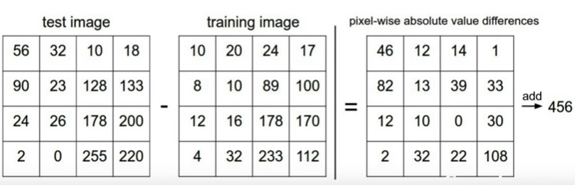
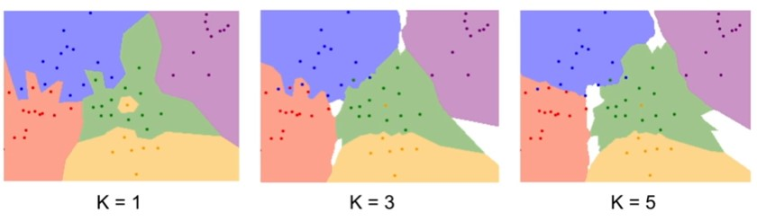

# Computer Vision Note

This is my note of which learning computer vision on [**cs231n**](https://www.youtube.com/watch?v=vT1JzLTH4G4&index=1&list=PLf7L7Kg8_FNxHATtLwDceyh72QQL9pvpQ), which is a course made by Stanford University.

## Lecture 1 | Introduction to Convolutional Netural Network for Visual Recognition

ImageNet http://www.image-net.org/

:smile: nothing to write ...

## Lecture 2 | Image Classification

### Intro

- An image classifier

  ```python
  def classify_image(image):
      # Some magic here?
      return class_label
  ```

- Data-Driven Approach

  ```python
  def train(images, labels):
      # Machine learning!
      return model
  
  def predict(model, test_images):
      # Use model to predict labels
      return test_labels
  ```

  1. Collect a dataset of image and labels

  2. Use Machine Learning to train a classifier

  3. Evaluate the classifier on new images

### First classifier: **Nearest Neighbor**

- **Distance Metric** to compare images

  **[L1 (Manhattan) distance](https://en.wikipedia.org/wiki/L1) (曼哈顿距离)**: 
  $$
  d_1(I_1,I_2) = \sum_{p} |I^p_1 - I^p_2|
  $$

  <p align="center">
      <p>
          
      	曼哈顿与欧几里得距离： 红、蓝与黄线分别表示所有曼哈顿距离都拥有一样长度（12），而绿线表示欧几里得距离有6×√2 ≈ 8.48的长度。
  	</p>
      <p>
          
  	</p>
  </p>

  Python Implement:

  ```python
  import numpy as np
  
  class NearestNeighor:
      def __init__(self):
          pass
      
      def train(self, X, y):
          """
          X is N x D where each row is an example.
          Y is l-dimension of size N
          """
          self.Xtr = X
          self.ytr = y
          
      def predict(self, X):
          """
          X is N x D where each row is an example we wish to predict lable for
          """
          num_test = X.shape[0]
          Ypred = np.zeros(num_test, dtype = self.ytr.dtype)
          
          # loop over all test rows
          for i in xrange(num_test):
              # find the nearest training image to the i`th test image
              # using the L1 distance (sum of absolute value differences)
              distance = np.sum(np.abs(self.Xtr - X[i,:]), axis = 1)
              # get the index with smallest distance
              min_index = np.argmin(distance)
              # predict the label of the mearest example
              Yred[i] = self.ytr[min_index] 
              return Ypred
  ```

  **Q**: With N example, how fast are training and prediction?

  **A**: train _O_(1), predict _O_(N)

  This is bad: we want classifier that are **fast** at prediction; **slow** for training is ok.

### K-Nearest Neighbors

Instead of copying label from nearest neighbor, take **majority vote** from K closest points.



**[L2 (Euclidean) distance](https://en.wikipedia.org/wiki/Euclidean_distance) (欧式距离)**:
$$
d_2(I_1,I_2) = \sqrt{\sum_{p} (I^p_1 - I^p_2)^2}
$$
[Demo](http://vision.stanford.edu/teaching/cs231n-demos/knn/)

Loading ...